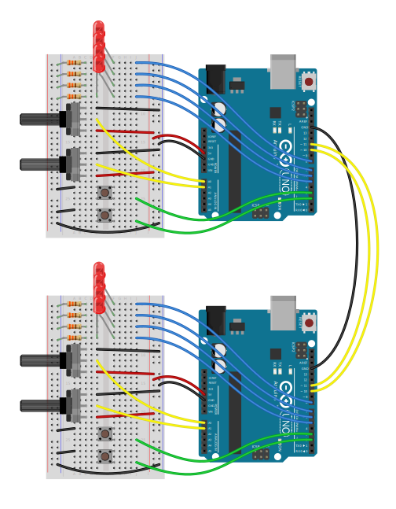
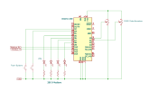

# ModbusRTUSlave Example Sketch
This example demonstrates how to setup and use the ModbusRTUSlave and the [ModbusRTUMaster](https://github.com/CMB27/ModbusRTUMaster) libraries.

For this example to work [ModbusRTUMasterExample](https://github.com/CMB27/ModbusRTUMaster/blob/main/examples/ModbusRTUMasterExample/ModbusRTUMasterExample.ino) needs to be uploaded to one of the Arduino boards and [ModbusRTUSlaveExample](https://github.com/CMB27/ModbusRTUSlave/blob/main/examples/ModbusRTUSlaveExample/ModbusRTUSlaveExample.ino) needs to be uploaded to the other.

If everything works properly, you should be able to control the LEDs connected to one board with the buttons and potentiometers connected to the other.

## Hardware Required
- 2 Arduino Boards
- 4 Pushbutton Switches
- 8 LEDs
- 8 330 Ohm Resistors
- 4 10K Ohm Potentiometers
- Wires

## Circuit
  
_Image deveolped using [Fritzing](https://fritzing.org/) and [Inkscape](https://inkscape.org/)._

## Schematic
  
_Note, this schematic only shows half the circuit. The other half is identical._  
_Image developed using [KiCad](https://www.kicad.org/) and [Inkscape](https://inkscape.org/)._


## Code
``` C++
/*
  ModbusRTUSlaveExample

  This example demonstrates how to setup and use the ModbusRTUSlave library.
  It is intended to be used with a second board running ModbusRTUMasterExample from the ModbusRTUMaster library.  
  
  Circuit:
  - A pushbutton switch from pin 2 to GND
  - A pushbutton switch from pin 3 to GND
  - A LED from pin 5 to GND with a 330 ohm series resistor
  - A LED from pin 6 to GND with a 330 ohm series resistor
  - A LED from pin 7 to GND with a 330 ohm series resistor
  - A LED from pin 8 to GND with a 330 ohm series resistor
  - The center pin of a potentiometer to pin A0, and the outside pins of the potentiometer to 5V and GND
  - The center pin of a potentiometer to pin A0, and the outside pins of the potentiometer to 5V and GND
  
  !!! If your board's logic voltage is 3.3V, use 3.3V instead of 5V; if in doubt use the IOREF pin !!!
  
  - Pin 10 to pin 11 of the master/client board
  - Pin 11 to pin 10 of the master/client board
  - GND to GND of the master/client board
  
  A schematic and illustration of the circuit is in the extras folder of the ModbusRTUSlave library.

  - Pin 13 is set up as the driver enable pin. This pin will be HIGH whenever the board is transmitting.
  
  Created: 2023-07-22
  By: C. M. Bulliner
  Modified: 2023-07-29
  By: C. M. Bulliner
  
*/

#include <SoftwareSerial.h>
#include <ModbusRTUSlave.h>

const byte ledPins[4] = {8, 7, 6, 5};
const byte buttonPins[2] = {3, 2};
const byte potPins[2] = {A0, A1};

const uint8_t rxPin = 10;
const uint8_t txPin = 11;
const uint8_t dePin = 13;

SoftwareSerial mySerial(rxPin, txPin);
ModbusRTUSlave modbus(mySerial, dePin); // serial port, driver enable pin for rs-485 (optional)

bool coils[2];
bool discreteInputs[2];
uint16_t holdingRegisters[2];
uint16_t inputRegisters[2];

void setup() {
  pinMode(ledPins[0], OUTPUT);
  pinMode(ledPins[1], OUTPUT);
  pinMode(ledPins[2], OUTPUT);
  pinMode(ledPins[3], OUTPUT);
  pinMode(buttonPins[0], INPUT_PULLUP);
  pinMode(buttonPins[1], INPUT_PULLUP);
  pinMode(potPins[0], INPUT);
  pinMode(potPins[1], INPUT);

  modbus.configureCoils(coils, 2);                       // bool array of coil values, number of coils
  modbus.configureDiscreteInputs(discreteInputs, 2);     // bool array of discrete input values, number of discrete inputs
  modbus.configureHoldingRegisters(holdingRegisters, 2); // unsigned 16 bit integer array of holding register values, number of holding registers
  modbus.configureInputRegisters(inputRegisters, 2);     // unsigned 16 bit integer array of input register values, number of input registers
  modbus.begin(1, 38400);                                // slave id, baud rate, config (optional)
}

void loop() {
  discreteInputs[0] = !digitalRead(buttonPins[0]);
  discreteInputs[1] = !digitalRead(buttonPins[1]);
  inputRegisters[0] = map(analogRead(potPins[0]), 0, 1023, 0, 255);
  inputRegisters[1] = map(analogRead(potPins[1]), 0, 1023, 0, 255);
  
  modbus.poll();

  digitalWrite(ledPins[0], coils[0]);
  digitalWrite(ledPins[1], coils[1]);
  analogWrite(ledPins[2], holdingRegisters[0]);
  analogWrite(ledPins[3], holdingRegisters[1]);
}
```